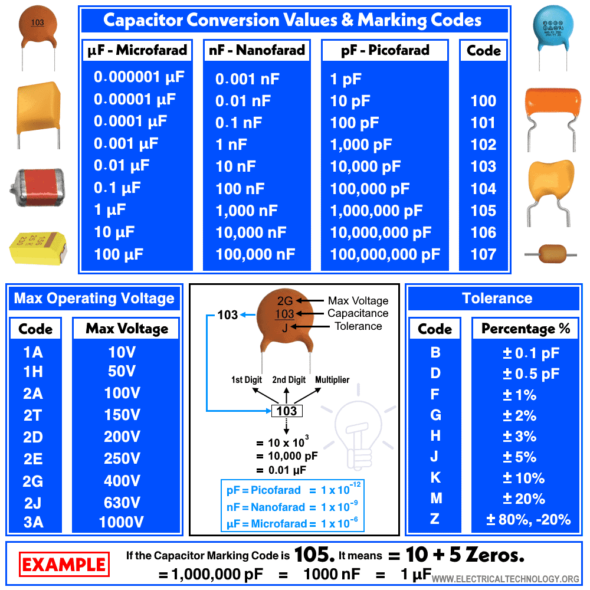
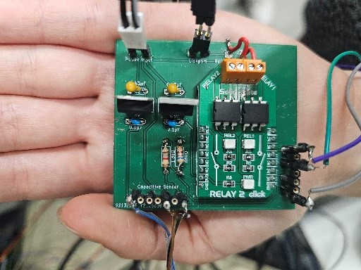
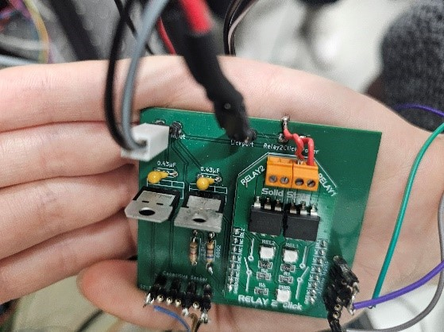
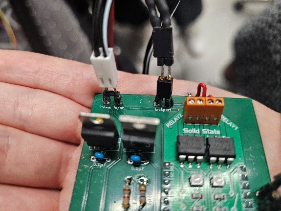
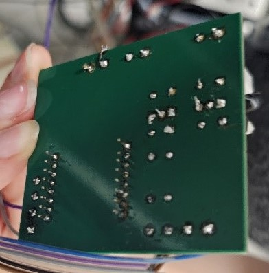
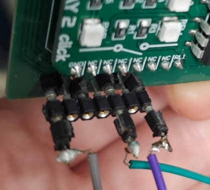

# LickPort - Electronic Board (Lick Detector / Valve)

**Last updated:** June 26, 2026

## Description
This folder contains all documentation and example code for the LickPort electronic board, used for lick detection and water valve control.

---

## Table of Contents
A. Photos of the LickPort board  
B. Objectives of the board  
C. Simplified wiring diagram
D. In practice, which wires to connect where?
E. Designated box to protect the electronic board
F. Example of Arduino code (with the Giga R1 wifi)
G. Appendices

---

## A. Photos of the LickPort board

_Photo of the board without components_  

_Photo of the board with components_

---

## B. Objectives of the board

This board allows you to:  
- Provide 12V power to the capacitive sensor and valve  
- Receive lick information from the capacitive sensor and send it to the Arduino at 3.3V (theoretical)  
- Open the valve via the Arduino (using the “relay2click” on the board)

---

## C. Simplified wiring diagram

- Square connections represent grounds (negative terminals)  

- Resistor selection: R1 = 680Ω, R2 = 1.8kΩ (3.3V output to Arduino)  

> Full schematic is available in the appendices

Note:
Choice of resistors R1 = 680Ω and R2 = 1.8kΩ in order to have an output to the Arduino at 3.3V

---

## D. Preparing the board by soldering the various components onto it

Before being able to use the board, several components need to be soldered:
- Two resistors of 680Ω and 1.8kΩ as described above
- Two tantalum capacitors (called "tantalum dipped capacitor"), the 35 means 35V (but I don't know about the µ1, probably 1µF but to be verified? – in practice use capacitors identical to the photo)
- Two ceramic capacitors "104" (refer to the appendices if needed for the 104 code equivalences)
- Two voltage regulators of 5V and 3.3V
- A "relay2 click" board from Mikroe (https://www.mikroe.com/relay-2-click)

Add the components in the right place and solder them (see photos of the assembled board in the appendices)

Notes:
Tantalum capacitors are polarised, so be careful to respect the orientation as shown in the image (the positive side of the capacitor is marked by a small plus sign, and it must be positioned at the square on the board).
Voltage regulators are also polarised, so care must be taken.
However, ceramic capacitors are not polarised.

---

## E. In practice, which wires to connect where?

1. 12V power supply  
2. Valve wires  
3. Capacitive sensor wires  
   a. ⚠️ Not used  
   b. 12V power to the sensor (brown wire)  
   c. Signal from sensor (black wire)  
4. Arduino connections (mandatory)  
   a. Arduino output → LickPort board to open the valve (violet wire)  
   b. Arduino input ← LickPort board to read licks (3.3V output, see diagram for details)  
5. Optional Arduino connection to power Arduino without connecting to computer  

⚠️ The female ports of the "lickport board" are smaller than standard (i.e. those of the Arduino), so if needed you will have to solder new intermediate connectors yourself. The cleanest solution still seems to be finding a pin that is male "lickport size" and female "Arduino size", so that prototyping wires can be placed directly between the Arduino and the electronic board.
⚠️⚠️⚠️ The version by Jimmy that was initially printed in four copies does not have standard spacing for the inputs and outputs of the electronic board (i.e. the ports indicated by 1, 2, 3 and 4). You should then try to find the least "ugly" solution to resolve this issue (for example, making a first layer of individual pins then placing the pins joined at standard spacing on top — by tilting the individual pins it should work). The best would be one day to reprint the board with the correct mesurement.

---

## E. Protective enclosure

The box was custom-made to avoid any strain on the solder joints and cables connected to the electronic board (as the connections are somewhat unusual).

The box was designed using the Tinkercad software.
Here are the links to access the designs:
- Box design: [Tinkercad link](https://www.tinkercad.com/things/hbnSuq6Cchr-boite-carte-lickport-v1-avec-accroches/edit?sharecode=Nxq6Zqytl9hEeUHwjgE4FO9mnY3RvXSJX_H6KoXoO60)  
- Lid design: [Tinkercad link](https://www.tinkercad.com/things/5hVfECfCvXz-couvercle-boite-carte-lickport-v1?sharecode=sEUgVh3V9k8983TuvGKIf2XeCjM6gngVLM33MLh_zIU)  

STL files are also included in the [`box_design`](box_design/) folder..

---

## F. Arduino code examples

All code files are in the [`code`](code/) folder.

- **Lick detection → Water valve activation**  
  File: `lickport_main.ino`

- **LickPort calibration**  
  File: `lickport_calibration.ino`

---

## G. Appendices

- Full electronic schematic (you can see the Kitcad version in the [`electronic`](electronic/)) folder.  

- For a better understanding of capacitance nomenclature (For further reading, here is the website: https://www.electricaltechnology.org/2022/01/capacitor-color-codes.html)

- Additional photos of the electronic board - 

